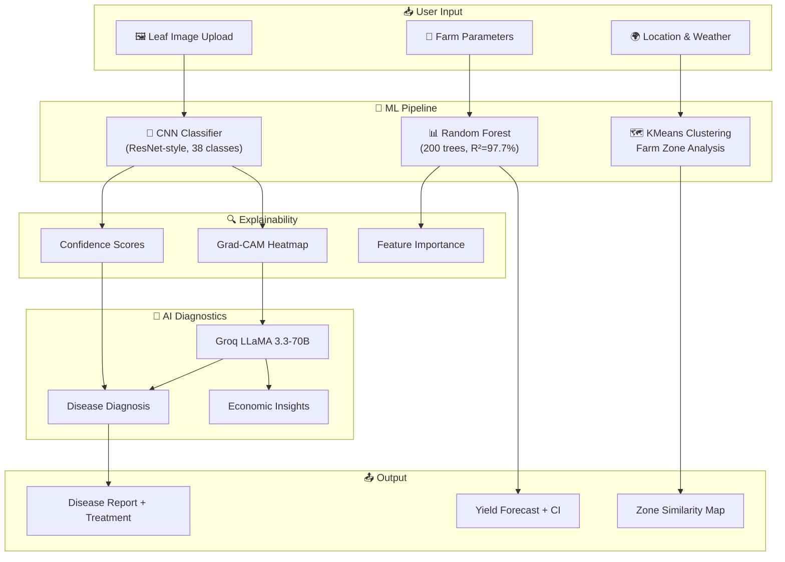
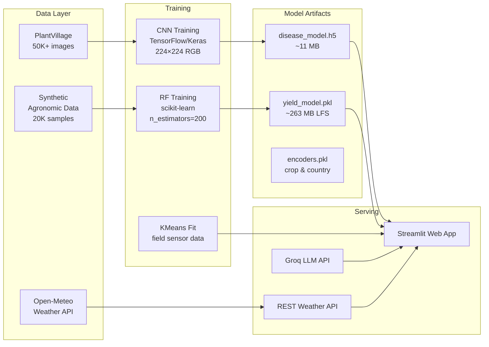
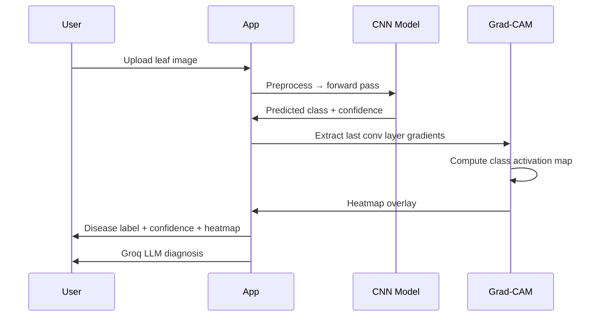

<div align="center">


# CropGuard AI

### Precision Agriculture Intelligence System

**AI-powered crop disease detection · Yield forecasting · Farm zone clustering**

[](https://python.org)
[](https://tensorflow.org)
[](https://streamlit.io)
[](https://scikit-learn.org)
[](https://groq.com)
[](LICENSE)

---

**[🚀 Live Demo](https://cropguard-ai-ku3qgsutxpneehq7nwzfac.streamlit.app/) · [📋 Report Bug](https://github.com/niharikaprasad1906/cropguard-ai/issues) · [✨ Request Feature](https://github.com/niharikaprasad1906/cropguard-ai/issues)**

</div>

---

## 📸 Overview

CropGuard AI is an end-to-end machine learning platform that empowers farmers and agronomists with:

- 🔬 **CNN-based leaf disease detection** across 14 crops with Grad-CAM explainability
- 📊 **Random Forest yield prediction** (R² = 97.7%) with 95% confidence intervals
- 🗺️ **KMeans farm zone clustering** for precision field management
- 🌦️ **Real-time weather integration** via Open-Meteo API
- 🤖 **Groq LLaMA 3.3** for AI-powered diagnosis and economic insights

---

## 🏗️ System Architecture



---

## 🔄 ML Pipeline



---

## ✨ Features

### 🔬 Tab 1 — Disease Classification

| Feature | Details |
|---|---|
| Model | CNN (ResNet-style architecture) |
| Dataset | PlantVillage (50,000+ labeled images) |
| Accuracy | **88%+** on holdout test set |
| Input | 224×224 RGB leaf images (JPG/PNG) |
| Output | 38 disease classes across **14 crops** |
| Explainability | **Grad-CAM heatmaps** highlighting disease regions |
| AI Diagnosis | Groq LLaMA 3.3 — symptoms, treatment, prevention |
| Weather Risk | Disease-specific alerts based on live conditions |

**Supported Crops:** Apple · Tomato · Potato · Corn · Pepper · Grape · Cherry · Peach · Strawberry · Squash · Raspberry · Soybean · Orange · Blueberry

### 📊 Tab 2 — Yield Prediction

| Feature | Details |
|---|---|
| Model | Random Forest (200 trees, max_depth=20) |
| R² Score | **97.7%** |
| MAE | **1.42 t/ha** |
| Features | Crop, country, year, rainfall, temperature, pesticides, area |
| Output | Yield (t/ha) with **95% confidence interval** |
| Visualization | 10-year historical trend chart |
| Disease-adjusted | Shows healthy vs disease-impacted yield estimates |

### 🗺️ Tab 3 — Farm Zone Clustering

- **KMeans clustering** groups farm zones by sensor attributes
- Identifies similar field conditions for targeted interventions
- Visualized on interactive Plotly charts

---

## 📁 Project Structure

```text
cropguard-ai/
├── 📂 app/
│   └── streamlit_app.py          # Main Streamlit application (1,258 lines)
│
├── 📂 src/                       # Source modules
│   ├── data/
│   │   ├── download_data.py      # Kaggle/dataset downloader
│   │   ├── loader.py             # Data loading utilities
│   │   └── preprocessing.py     # Image & tabular preprocessing
│   ├── models/
│   │   ├── cnn.py                # CNN model definition
│   │   ├── regression.py         # RF regression wrapper
│   │   └── clustering.py        # KMeans clustering
│   ├── training/
│   │   ├── train_disease.py      # CNN training pipeline
│   │   ├── train_yield.py        # RF training with synthetic data
│   │   └── train_cluster.py      # Clustering training
│   └── utils/
│       └── config.py             # Shared configuration
│
├── 📂 models/                    # Trained model artifacts (Git LFS)
│   ├── disease_model.h5          # CNN disease classifier (11 MB)
│   ├── disease_classes.json      # 38 disease class mappings
│   ├── yield_model.pkl           # Random Forest (263 MB — Git LFS)
│   ├── yield_columns.pkl         # Feature column names
│   ├── yield_crop_encoder.pkl    # Crop label encoder
│   ├── yield_country_encoder.pkl # Country label encoder
│   ├── crop_list.json            # Supported crops
│   └── country_list.json         # Supported countries
│
├── 📂 .github/
│   └── workflows/
│       └── ci.yml                # CI — lint & audit on push
│
├── 📂 .streamlit/
│   ├── config.toml               # Theme & server config (committed)
│   └── secrets.toml              # API keys (NEVER committed — .gitignored)
│
├── .gitattributes                # Git LFS tracking rules
├── .gitignore                    # Comprehensive ignore rules
├── requirements.txt              # Python dependencies
├── main.py                       # Entry-point helper
└── README.md                     # This file
```

---

## 🚀 Quick Start

### 1. Clone the repository

```bash
git clone https://github.com/niharikaprasad1906/cropguard-ai.git
cd cropguard-ai
```

### 2. Set up virtual environment

```bash
python -m venv venv

# Windows
venv\Scripts\activate

# macOS / Linux
source venv/bin/activate
```

### 3. Install dependencies

```bash
pip install -r requirements.txt
```

### 4. Configure secrets

Create `.streamlit/secrets.toml`:

```toml
GROQ_API_KEY = "gsk_your_key_here"
```

> Get a **free** Groq API key at [console.groq.com](https://console.groq.com) — includes $25/month free credits.

### 5. Download/train models (optional)

The `models/` directory should contain pre-trained artifacts. To retrain from scratch:

```bash
# Download PlantVillage data
python src/data/download_data.py

# Train models
python src/training/train_disease.py
python src/training/train_yield.py
python src/training/train_cluster.py
```

### 6. Run the app

```bash
streamlit run app/streamlit_app.py
```

Open [http://localhost:8501](http://localhost:8501) 🎉

---

## ☁️ Deployment

### Streamlit Community Cloud (Recommended — Free)

[](https://share.streamlit.io)

1. Push this repo to GitHub
2. Go to [share.streamlit.io](https://share.streamlit.io)
3. Click **"New app"** → connect your GitHub repo
4. Set **Main file path**: `app/streamlit_app.py`
5. Under **Advanced settings → Secrets**, add:
   ```toml
   GROQ_API_KEY = "gsk_your_key_here"
   ```
6. Click **Deploy** ✅

---

## 🧪 Model Details

### Disease Detection CNN

```
Input:  (224, 224, 3)  — RGB leaf image
Conv blocks → MaxPool → Dropout
Output: (38,) — softmax probabilities
```

| Metric | Value |
|--------|-------|
| Architecture | CNN (ResNet-style) |
| Training data | PlantVillage (50K+ images) |
| Test accuracy | **88%+** |
| Classes | 38 across 14 crops |
| Explainability | Grad-CAM heatmaps |

### Yield Prediction Random Forest

| Metric | Value |
|--------|-------|
| Algorithm | Random Forest Regressor |
| n_estimators | 200 |
| max_depth | 20 |
| R² score | **97.7%** |
| MAE | **1.42 t/ha** |
| Training samples | 20,000 synthetic |
| Feature count | 7 |

### Grad-CAM Explainability Flow



---

## 🛠️ Technology Stack

| Layer | Technology | Purpose |
|-------|-----------|---------|
| **Frontend** | Streamlit | Interactive web UI |
| **Deep Learning** | TensorFlow / Keras | CNN disease classifier |
| **ML** | scikit-learn | Random Forest, KMeans |
| **LLM** | Groq (LLaMA 3.3-70B) | AI diagnostics & insights |
| **Visualization** | Plotly | Interactive charts |
| **Weather** | Open-Meteo API | Real-time weather data |
| **Explainability** | Grad-CAM | CNN visualization |
| **Data** | Pandas, NumPy | Data processing |
| **Tracking** | MLflow | Experiment tracking |
| **Deployment** | Streamlit Community Cloud | Production hosting |

---

## ⚙️ API Keys

| Service | Required | Free Tier | Purpose |
|---------|----------|-----------|---------|
| [Groq](https://console.groq.com) | ✅ Yes | $25/month credits | AI diagnosis + economic insights |
| [Open-Meteo](https://open-meteo.com) | ❌ No | Unlimited | Real-time weather data |
| [Kaggle](https://kaggle.com) | Optional | Free | Download PlantVillage dataset |

---

## ⚠️ Limitations

1. **Disease model trained on PlantVillage** — controlled lab conditions; real-world field photos may vary
2. **Synthetic yield data** — generated using agronomic parameters, not real farm records
3. **14 crops supported** — other crops not recognized
4. **Climate extrapolation** — yield predictions beyond 2024 are extrapolated

---

## 🗺️ Roadmap

- [ ] Top-3 disease predictions with confidence ranking
- [ ] Scan history & analytics dashboard
- [ ] Multi-language UI (Hindi, Gujarati for Indian farmers)
- [ ] Mobile PWA app
- [ ] Real yield dataset integration (FAO, FAOSTAT)
- [ ] Soil quality inputs for improved predictions
- [ ] WhatsApp bot integration for rural access

---

## 🤝 Contributing

Contributions are very welcome!

```bash
# 1. Fork the repo
# 2. Create your feature branch
git checkout -b feature/amazing-feature

# 3. Commit your changes
git commit -m "feat: add amazing feature"

# 4. Push and open a PR
git push origin feature/amazing-feature
```

Please follow [Conventional Commits](https://www.conventionalcommits.org/) for commit messages.

---

## 📄 License

This project is licensed under the **MIT License** — see the [LICENSE](LICENSE) file for details.

---

## 🙏 Acknowledgements

- [PlantVillage Dataset](https://plantvillage.psu.edu/) — Penn State University
- [Groq](https://groq.com) — Ultra-fast LLM inference
- [Open-Meteo](https://open-meteo.com) — Free weather API
- [Streamlit](https://streamlit.io) — Python web framework

---

<div align="center">

**Built with ❤️ for farmers & agricultural data scientists**

*CropGuard AI — Making precision agriculture accessible to everyone.*

</div>
